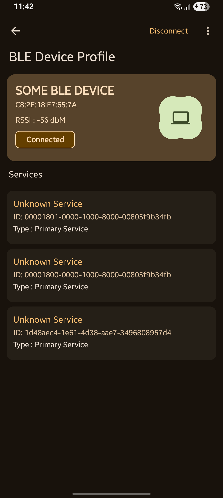

# :large_blue_circle: Bluetooth Terminal App

This Bluetooth Android Terminal App facilitates interaction with Bluetooth and Bluetooth Low
Energy (BLE) devices. The app provides a user-friendly interface to manage connections, interact
with devices.

## :information_desk_person: Description

The Bluetooth Android Terminal App supports both classic Bluetooth and Bluetooth Low Energy (BLE)
connections. It allows users to scan for available devices, establish connections, and communicate
with connected devices.
Additionally, the app includes a built-in server functionality for simple chat interactions between
two devices running the same app

## :performing_arts: Features

### Classic Bluetooth

- **Devices:** Display a list of paired devices and available unpaired devices.
- **Connect and Interact:** Allow the user to communicate with the connected device if the
  connection is successfully made
- **Chat Server:** Start a server within the app to connect to other phones and chat.
- **Settings:** You can check out some settings for you customized communication

### Bluetooth Low Energy (BLE)

- **Scan for Devices:** Scan for devices supporting bluetooth low energy
- **Services and Charateristics:** Display available services and characteristics for the connected
  device. Allow users to read ,write or observe values to the characteristics .
- **Settings:** You can customize scan settings for the app to discover your device.

## :camera_flash: Screenshots

These are some of the screens shots showing the working of basic bluetooth connection

<p align="center">
   
   
   
     
   
</p>

This screenshots shows the working of a bluetooth low energy servics and characteristics

<p align="center">
   
   
     
   
   
</p>

## :building_construction: Getting Started

Make sure the device supports **Bluetooth** and if possible **Bluetooth Low Energy** to check out
its functionalities

1. **Clone the Repository:**

   ```bash
   git clone https://github.com/tuuhin/BTAndroidApp.git

   ```

2. **Open Project**
   Open the project in android studio

3. **Build and Run**
   Build and run on android device with api _29_ and above

### :curly_loop: Feedback and Support

If you encounter any problems or bugs in the app ,please feel to open an issue

### :woman_cook: Contributing

Contributions are alaways welcomed from the community

- Fork the repository.
- Create your feature branch (git checkout -b feature/YourFeature).
- Commit your changes (git commit -am 'Add some feature').
- Push to the branch (git push origin feature/YourFeature).
- Create a new Pull Request.

## :end: Conclusiion

The Bluetooth Android Terminal App is a versatile tool for interacting with Bluetooth and BLE
devices. While the app aims to provide a seamless experience, it may contain bugs. If you encounter
any issues, please raise an issue on the GitHub repository.

### :revolving_hearts: Special Thanks

Special thanks two most used bluetooth terminal apps.

- [Nordic Semiconductor android app](https://github.com/NordicSemiconductor/Android-nRF-Connect)
- [Simple Bluetooth termial](https://github.com/kai-morich/SimpleBluetoothTerminal)
